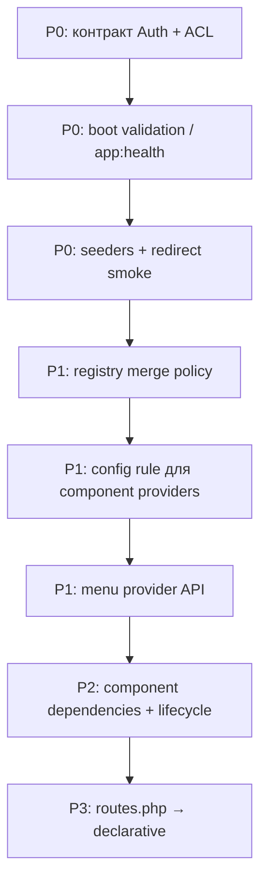

# Пріоритетний backlog міграції

> **Коротко:** архітектуру не переобдумували — довели, що вона здатна на виживання. Наступний крок — не ще один extension, а **жорсткіші контракти на межах**: auth/ACL, menu/sidebar, boot validation, merge policy для registry.
>
> Без рефакторингу заради рефакторингу. Довідник сесії: [AGENTS.md](AGENTS.md).

---

## Стратегічна оцінка

| Питання | Відповідь |
|---------|-----------|
| Треба було переробляти з нуля? | **Ні** — і це плюс старому дизайну |
| Міграція вдалась? | **Так** — декомпозиція, не редизайн |
| Є ризик «перенесли legacy у нові папки»? | **Є** — якщо не додати glue-валідацію і чіткі контракти |
| Найслабше місце зараз | Auth + ACL + redirect policy як **один UX-контракт** |
| Найсильніше місце | Component manifest + registry append — реальний актив |

---

## Що вийшло добре (не ввічливість)

### Manifest + registry

Компонент сам каже, що приносить; framework лише збирає. «Перенести майже як є» тут — не лінь, а **валідація дизайну**: після розрізання core патерн пережив міграцію.

Активна реалізація: `src/Extensions/Components/`, glue — `ApplicationComponentsServiceProvider`.

### Тонке ядро

`App` + routing + interceptors + resolvers — справді ядро. DB, view, console, components — плагіни. Багато фреймворків роблять навпаки.

### Config у glue, не в core

Extension з явними параметрами легше тестувати і виносити в окремий composer-пакет. `ApplicationServiceProvider` читає config → передає в providers.

---

## «Майже те саме» = тягнеш борг разом із архітектурою

Архітектура нова, але **boot chain не валідує себе**. Система стартує «успішно», а падає на першому реальному сценарії.

Приклади з практики (не баги нової архітектури, а слабке місце glue):

| Симптом | Що це означає |
|---------|----------------|
| Петля редіректів після login | Auth і ACL не узгоджені; redirect policy без контракту |
| `admin.menu` / sidebar очікує маршрут, якого немає | Меню skeleton знає про компоненти, але не валідує їх наявність |
| `AssignUserAclRolesSeeder` не запущений | Admin з `is_admin=1`, але `acl_role_id = null` → ACL відмовляє мовчки |

---

## Вісім зон критики → backlog

### 1. Boot chain не валідує себе

**Проблема:** немає перевірки після старту, що критичний шлях живий.

**Пріоритет: P0**

**Дія (мінімальна, без переписування):**

- CLI `app:health` або dev-only smoke після boot:
  - named routes з sidebar існують (`route:list` + перевірка ключів)
  - критичні seeders виконані (або warning, якщо `acl_role_id` null у admin)
  - ACL role resolver не повертає null для залогіненого admin
- Документувати обов'язковий post-install: `db:migrate`, `db:seed`, `component:publish-assets`

**Не робити:** важкий health framework з десятком checks «про запас».

---

### 2. Два шари авторизації без контракту

**Проблема:** `AuthMiddleware` (`is_admin`) і ACL (`acl_role_id` / role `user`) — різні моделі в одному `/admin`.

```
login OK → AuthMiddleware пустив → ACL відмовив → redirect → знову ACL → hell
```

**Пріоритет: P0** (найслабше місце)

**Обрати і зафіксувати один варіант** (в коді + короткий коментар у `config/acl.php` або README):

| Варіант | Семантика |
|---------|-----------|
| **A. ACL — єдине джерело** | `is_admin` deprecated; доступ = ACL role |
| **B. is_admin = gate, ACL = всередині** | Login gate лише `is_admin`; у `/admin` тільки ACL |
| **C. Розділити явно** | `is_admin` = вхід у зону; ACL = що бачиш (документований контракт) |

**Дія зараз (рекомендація B/C, мінімальний diff):**

1. Задокументувати обраний варіант у цьому файлі (секція «Контракт Auth + ACL» нижче).
2. `AssignUserAclRolesSeeder` — у default seed flow або health warning.
3. `AclRouteAuthorization`: якщо redirect target = поточний route → fallback на `admin.login` (вже частково є — перевірити всі гілки).
4. Smoke: login → dashboard → ACL-denied route → один redirect, не loop.

**Файли:** `AuthMiddleware`, `AclRouteAuthorization`, `HandleAccessDeniedMiddleware`, `config/acl.php`.

**Не робити:** переписувати Laminas ACL або сесію.

---

### 3. ComponentRegistry — god-orchestrator

**Проблема:** registry знає про routes, views, migrations, seeders, commands, assets. Компонент не існує поза схемою. Немає:

- порядку залежностей (SettingsManager після Acl)
- lifecycle (install / upgrade)
- ізольованого boot одного компонента в тесті

**Пріоритет: P2** (ок для bootstrap; болить при масштабуванні)

**Дія, коли дійде черга:**

- `ComponentInterface::dependencies(): list<string>` — імена компонентів, topological sort при boot
- Опційно `ComponentBootTest` — один компонент + mock container
- Lifecycle (`install()`) — лише якщо з'явиться upgrade path між версіями

**Не робити зараз:** дробити registry на 6 окремих orchestrator-ів.

---

### 4. `require routes.php` + глобальний `$router`

**Проблема:** неочевидно для IDE; важко мокати; порядок `require` = порядок middleware (неявний).

**Пріоритет: P3** (не критично для admin-панелі)

**Дія:** лишати як є, поки components не стануть публічним API фреймворку. Тоді — declarative route arrays або route builder.

**Не робити:** масовий рефакторинг усіх `src/Components/*/routes.php`.

---

### 5. Registry `append()` без політики merge

**Проблема:** `array_merge` для view contexts, seeders, paths — останній виграє або дублює мовчки.

**Пріоритет: P1**

**Дія (мінімальна):**

- dedup для seeders/commands при append
- у `APP_DEBUG`: warning/log на конфлікт view context keys (два компоненти → різний context для `/admin`)

**Файли:** `ViewRegistry`, `SeederRegistry`, `ComponentRegistry::append*`.

**Не робити:** складну merge-стратегію з пріоритетами до появи реального конфлікту.

---

### 6. Непослідовність «extensions не читають config»

**Проблема:** glue читає config — добре. Але `AclServiceProvider` знову тягне `ConfigInterface` (`acl.storage`, `acl.role_resolver`).

**Пріоритет: P1**

**Варіанти (обрати один):**

| Підхід | Коли |
|--------|------|
| **Виняток у правилах** | «Component-internal provider може читати config» — задокументувати в AGENTS.md |
| **Винести в glue** | `ApplicationComponentsServiceProvider` читає `acl.*` → передає в `AclServiceProvider` конструктором |

**Не робити:** вимагати, щоб усі providers були без config, якщо це ламає ізольований component package.

---

### 7. Розмиті межі skeleton vs component (sidebar)

**Проблема:**

- Layout/sidebar — `resources/views/dashboard/` (skeleton)
- Views компонентів — `src/Components/*/Views`
- `has_component('Acl')`, `has_component('SettingsManager')`, `has_component('ProjectManager')` у `_sidebar.twig`

**Inverse dependency:** app template залежить від набору плагінів.

**Пріоритет: P1** (довгостроково), **P0** лише якщо sidebar ламається на prod

**Дія:**

1. Короткостроково: sidebar рендерить пункт лише якщо `has_component()` **і** `route:list` має named route.
2. Довгостроково: `ComponentInterface::menuItems(): array` або `MenuContributorInterface`; sidebar лише ітерує список.

**Файли:** `resources/views/dashboard/partials/_sidebar.twig`, `AppExtension::has_component`.

**Не робити:** переносити весь dashboard layout у компоненти.

---

### 8. Dev/prod divergence без контракту

**Проблема:** `config/dev/components.php` додає DebugBar. Компонентний набір різний по env — легко зловити «на prod немає route X», якого sidebar очікує.

**Пріоритет: P1**

**Дія:**

- Правило: **dev-only компоненти не можуть бути в sidebar без `has_component()` guard** (вже частково є).
- `app:health` / smoke: sidebar links ⊆ `route:list`.
- Документувати: які компоненти prod-required vs dev-optional.

**Не робити:** уніфікувати dev/prod component set «для симетрії».

---

## Пріоритетний порядок роботи



### P0 — робити першим

| # | Задача | Чому зараз |
|---|--------|------------|
| 1 | **Контракт Auth + ACL** — обрати варіант A/B/C, задокументувати, виправити redirect loop | Найслабше місце; блокує реальний UX |
| 2 | **`AssignUserAclRolesSeeder` у seed flow** або health warning | Admin без `acl_role_id` → тиха відмова ACL |
| 3 | **`app:health` / smoke-check** після boot | Старт «успішний», сценарій падає |
| 4 | **Sidebar ↔ routes** — пункт меню лише якщо route існує | `admin.menu`, missing routes на prod |

### P1 — наступна хвиля

| # | Задача |
|---|--------|
| 5 | Merge policy: dedup seeders/commands, warning на конфлікт view contexts (dev) |
| 6 | Формалізувати правило config: glue vs component-internal provider |
| 7 | `menuItems()` / `MenuContributorInterface` — прибрати hardcode імен компонентів з sidebar |
| 8 | Dev/prod component contract у README або цьому файлі |

### P2 — коли додаєш компоненти або масштабуєш

| # | Задача |
|---|--------|
| 9 | `dependencies()` + topological sort у registry |
| 10 | Container-resolved component providers (`new $providerClass()` → container) |
| 11 | Boot-order коментар у `bootstrap/providers.php` |
| 12 | Checklist для нового компонента (див. нижче) |

### P3 — не чіпати без причини

| # | Задача |
|---|--------|
| 13 | `require routes.php` → declarative routes |
| 14 | Розбивати `ApplicationServiceProvider` |
| 15 | Спростити `class => class` у `config/components.php` |
| 16 | Lifecycle install/upgrade для компонентів |

---

## Контракт Auth + ACL (заповнити після рішення)

> **Статус:** TBD — обрати варіант і оновити цю секцію.

| Шар | Відповідальність (запропоновано: варіант C) |
|-----|---------------------------------------------|
| `AuthMiddleware` | Користувач залогінений і `is_admin = true` → може увійти в `/admin` |
| `AclRouteAuthorization` | Для named route перевіряє ACL privilege; deny → redirect за правилом |
| `SessionRoleResolver` | `acl_role_id` з user → Laminas role; **null = deny** (не guest) |
| Seed | `AssignUserAclRolesSeeder` призначає role `admin` існуючим admin-користувачам |

**Redirect policy:**

- deny на route X → `acl.redirect_route_name` (default `admin.dashboard`)
- якщо redirect target = поточний route → `admin.login` (anti-loop)
- `HandleAccessDeniedMiddleware` — єдине місце HTTP-відповіді на `AccessDeniedException`

---

## Checklist: новий компонент

- [ ] `implements ComponentInterface` (`Concept\Extensions\Components\Contracts`)
- [ ] У `config/components.php` (prod) або `config/dev/components.php` (dev-only)
- [ ] `routes.php` — named routes; узгоджені з ACL matrix
- [ ] `Providers/` — DI через container, не `new` без потреби
- [ ] Views: `viewPaths()` + `viewContexts()` (`/admin` → `dashboard`)
- [ ] Migrations/seeders через manifest
- [ ] Якщо пункт у sidebar — `menuItems()` (коли API з'явиться) або guard `has_component()` + route exists
- [ ] `component:publish-assets` після зміни assets
- [ ] Не покладатися на dev-only компоненти в prod sidebar

---

## Що НЕ переносити 1:1 з `concept-core-2/storage`

| Старе | Заміна |
|-------|--------|
| `ComponentsServiceProvider` у core | `Extensions/Components` + glue |
| `ConfigKey` / config discovery у core | Skeleton `config/` + `ApplicationServiceProvider` |
| `RequestProxy` | Enriched request через resolvers |
| Monolithic `RouteStrategy` | Chain of `ArgumentResolverInterface` |
| Auto-publish assets on boot | `component:publish-assets` |

---

## Event bus + Telemetry ([league/event](https://event.thephpleague.com/))

### Архітектура

| Шар | Відповідальність |
|-----|------------------|
| **Core** | Lifecycle event DTO (`Concept\Core\Events\Http\*` only); `?EventDispatcherInterface` у `RouteStrategy` / `HttpServiceProvider` |
| **Extensions** | Власні event DTO (`DatabaseQueryExecuted`, `FormRequestValidated`, `TemplateRendered`, `ComponentRegistered`, …) — dispatch у своєму коді |
| **Extension Event** | `League\Event\EventDispatcher`, `EventServiceProvider`, реєстрація `ListenerSubscriber` |
| **Extension Telemetry** | `TelemetryCollector` + `TelemetryEventSubscriber` (лише core HTTP) |
| **Telemetry component** (glue) | `TelemetryServiceProvider`, bridge subscribers, config, `EventSubscriberCollector` |
| **DebugBar component** (glue) | UI consumer `TelemetryCollector` |
| **Bootstrap** | `TelemetryServiceProvider` реєструється до `ApplicationServiceProvider` (event bus до components boot) |

Core залежить лише від `psr/event-dispatcher`. Реалізація — `league/event` v3 у extension.

### Політика вкл./викл. (config → glue → explicit params)

**Extensions не читають config для events.** Glue вирішує:

| Config key | Ефект |
|------------|--------|
| `events.enabled` | `false` → `dispatcher = null` у core/extensions; події не dispatch |
| `telemetry.enabled` | `false` → `TelemetryEventSubscriber` не реєструється |
| `telemetry.db_queries` | `false` → без `DatabaseQueryExecuted`; `true` + dispatcher → emit у `DatabaseEloquentServiceProvider` |
| `telemetry.logs` | `false` → без `TelemetryLogHandler`; `true` → handler на `LoggerMonolog` |

Файли: `src/Components/Telemetry/config/telemetry.php` (re-export у `config/telemetry.php`), `config/events.php`, overlays у `config/dev/`.

### Поточний стан реалізації

- [x] Core: `RouteInterceptorInvoked`, `RouteHandlerInvoked` + dispatch у `RouteStrategy`
- [x] Extension Event: `EventServiceProvider` + `league/event`
- [x] Extension Telemetry: collector + `TelemetryEventSubscriber`
- [x] Telemetry component: `TelemetryServiceProvider` (collector, event bus, log handler, subscribers)
- [x] DB query events (`telemetry.db_queries`)
- [x] Template render events (`ViewTwig`)
- [x] Component registered events (`ComponentsServiceProvider`)
- [x] Log events (`telemetry.logs`)
- [x] `RequestHandled` у `App::handle()` + `FormRequestValidated` у resolver

### HTTP lifecycle (повний набір для DebugBar Timeline)

| Event | Namespace | Джерело |
|-------|-----------|---------|
| `RouteInterceptorInvoked` | `Concept\Core\Events\Http` | `RouteStrategy` |
| `RouteHandlerInvoked` | `Concept\Core\Events\Http` | `RouteStrategy` |
| `RequestHandled` | `Concept\Core\Events\Http` | `App::handle()` |
| `FormRequestValidated` | `Concept\Extensions\FormRequest\Events` | `FormRequestArgumentResolver` |
| `TemplateRendered` | `Concept\Extensions\View\Events` | `TwigView` (і майбутній `PlatesView`) |
| `DatabaseQueryExecuted` | `Concept\Extensions\DatabaseEloquent\Events` | `DatabaseEloquentServiceProvider` |
| `ComponentRegistered` / `ComponentRoutesRegistered` | `Concept\Extensions\Components\Events` | `ComponentsServiceProvider` |

DebugBar **Components** tab — список зареєстрованих компонентів (`FRAMEWORK_COMPONENT_REGISTERED`), без awakening.

### Порядок boot (events)

1. `bootstrap/providers.php` — `TelemetryServiceProvider` (до logger і components)
2. `TelemetryServiceProvider::register()` — extension `TelemetryCollector`
3. `TelemetryServiceProvider::boot()` — subscribers + `EventServiceProvider` (якщо `telemetry.enabled` + `events.enabled`)
4. Extensions з `EventDispatcherResolver::optional($container)` — без прокидання dispatcher у glue

---

## Швидка перевірка

```bash
cd /var/www/concept-skeleton-dev-2

COMPOSER=composer-dev.json composer phpstan
php bin/console.php component:list
php bin/console.php route:list
php bin/console.php db:seed          # якщо ще не seeded
php bin/console.php component:publish-assets
```

**HTTP smoke:** `/` → `/admin/login` → dashboard → ACL-protected route → один redirect, без loop.

**Майбутнє:** `php bin/console.php app:health` — автоматизує route/sidebar/ACL checks з P0.

---

## Референс: де що живе

| Шар | Шлях |
|-----|------|
| Ядро | `/var/www/concept-core-2/src/` |
| Reference (не wire) | `concept-core-2/storage/` |
| Extensions | `src/Extensions/` |
| Components | `src/Components/` |
| Glue | `src/App/Providers/`, `bootstrap/` |
| Admin UX shell | `resources/views/dashboard/` |
| Component enable list | `config/components.php`, `config/dev/components.php` |

---

*Останнє оновлення: 2026-06-26 — event bus (league/event) + telemetry subscriber; enable policy у config/glue.*
