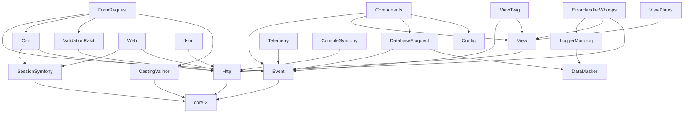

# Залежності розширень

Прямі залежності з `composer.json` кожного пакета в `src/Extensions/{Name}/`.

- **Зовнішні** — сторонні Composer-пакети (не `php-concept/*`).
- **Внутрішні** — інші розширення skeleton або ядро `php-concept/core-2`.
- **Транзитивні** залежності (через інші пакети) тут не перелічуються.

> `php: ^8.4` і `league/container: ^5.1` — у всіх розширеннях; нижче не повторюються.

---

## Повна таблиця прямих залежностей

| Розширення | Composer package | Ядро | Внутрішні extensions | Зовнішні бібліотеки |
|------------|------------------|:----:|----------------------|---------------------|
| **CastingValinor** | `extension-casting-valinor` | ✓ | — | `cuyz/valinor` ^2.0 |
| **Components** | `extension-components` | ✓ | Config, DatabaseEloquent, View, Event | `league/route` ^6.2, `symfony/console` ^7.2, `symfony/filesystem` ^7.2, `psr/event-dispatcher` ^1.0 |
| **Config** | `extension-config` | — | — | `hassankhan/config` ^3.2, `vlucas/phpdotenv` ^5.6 |
| **ConsoleSymfony** | `extension-console-symfony` | — | Http | `symfony/console` ^7.2\|^8.0 |
| **Csrf** | `extension-csrf` | ✓ | Http, SessionSymfony | `psr/http-message` ^2.0, `psr/http-server-middleware` ^1.0 |
| **DataMasker** | `extension-data-masker` | — | — | — |
| **DatabaseEloquent** | `extension-database-eloquent` | ✓ | DataMasker, Event | `illuminate/database` ^13.1, `illuminate/events` ^13.1, `illuminate/container` ^13.1, `illuminate/filesystem` ^13.1, `illuminate/pagination` ^13.1, `symfony/console` ^7.2\|^8.0, `monolog/monolog` ^3, `psr/event-dispatcher` ^1.0, `psr/http-message` ^2.0 |
| **ErrorHandlerWhoops** | `extension-error-handler-whoops` | — | Http, View, LoggerMonolog | `filp/whoops` ^2.18, `laminas/laminas-httphandlerrunner` ^2.13, `psr/container` ^2.0, `psr/http-message` ^2.0 |
| **Event** | `extension-event` | ✓ | — | `league/event` ^3.0, `psr/event-dispatcher` ^1.0 |
| **FormRequest** | `extension-form-request` | ✓ | CastingValinor, ValidationRakit, Csrf, Event | `psr/http-message` ^2.0, `psr/event-dispatcher` ^1.0 |
| **Http** | `extension-http` | ✓ | — | `laminas/laminas-diactoros` ^3.8, `league/route` ^6.2 |
| **Json** | `extension-json` | — | Http | `psr/http-message` ^2.0, `psr/http-server-middleware` ^1.0 |
| **LoggerMonolog** | `extension-logger-monolog` | — | DataMasker | `monolog/monolog` ^3, `psr/log` ^3 |
| **SessionSymfony** | `extension-session-symfony` | ✓ | — | `symfony/http-foundation` ^7.2 |
| **Telemetry** | `extension-telemetry` | ✓ | Event | `league/event` ^3.0, `monolog/monolog` ^3 |
| **ValidationRakit** | `extension-validation-rakit` | ✓ | Http | `magewirephp/validation` ^1.0 |
| **View** | `extension-view` | ✓ | Http | `psr/http-message` ^2.0 |
| **ViewPlates** | `extension-view-plates` | ✓ | View | `league/plates` ^3.6 |
| **ViewTwig** | `extension-view-twig` | ✓ | View, Event | `twig/twig` ^3.0, `symfony/console` ^7.2\|^8.0, `symfony/filesystem` ^7.2\|^8.0 |
| **Web** | `extension-web` | — | Http, SessionSymfony | `psr/http-message` ^2.0, `psr/http-server-middleware` ^1.0 |

---

## Граф внутрішніх залежностей (extensions → extensions)

---

## Зовнішні бібліотеки → розширення (прямі)

| Бібліотека | Розширення | Призначення в extension |
|------------|------------|-------------------------|
| `cuyz/valinor` | CastingValinor | DTO / typed casting |
| `filp/whoops` | ErrorHandlerWhoops | dev error pages |
| `hassankhan/config` | Config | PHP config merge |
| `illuminate/container` | DatabaseEloquent | Eloquent IoC |
| `illuminate/database` | DatabaseEloquent | Eloquent ORM |
| `illuminate/events` | DatabaseEloquent | Eloquent event dispatcher |
| `illuminate/filesystem` | DatabaseEloquent | migrations / seeders paths |
| `illuminate/pagination` | DatabaseEloquent | paginator |
| `laminas/laminas-diactoros` | Http | PSR-7 implementation |
| `laminas/laminas-httphandlerrunner` | ErrorHandlerWhoops | SAPI response emit |
| `league/event` | Event, Telemetry | event bus |
| `league/plates` | ViewPlates | Plates engine |
| `league/route` | Http, Components | HTTP router |
| `magewirephp/validation` | ValidationRakit | validation rules |
| `monolog/monolog` | DatabaseEloquent, LoggerMonolog, Telemetry | query log / app log / telemetry log handler |
| `psr/event-dispatcher` | DatabaseEloquent, Components, Event, FormRequest | PSR-14 contract |
| `psr/http-message` | DatabaseEloquent, Csrf, ErrorHandlerWhoops, FormRequest, Json, View, Web | PSR-7 contract |
| `psr/http-server-middleware` | Csrf, Json, Web | PSR-15 middleware |
| `psr/log` | LoggerMonolog | PSR-3 contract |
| `psr/container` | ErrorHandlerWhoops | PSR-11 contract |
| `symfony/console` | DatabaseEloquent, Components, ConsoleSymfony, ViewTwig | CLI commands |
| `symfony/filesystem` | Components, ViewTwig | assets publish / `view:clear` cache |
| `symfony/http-foundation` | SessionSymfony | session + flash |
| `twig/twig` | ViewTwig | Twig engine |
| `vlucas/phpdotenv` | Config | `.env` loading |

---

## Примітки

- **ViewTwig** не залежить від `illuminate/*` — кеш views очищається через `symfony/filesystem` (`view:clear`), Twig loader — `twig/twig` `FilesystemLoader`.
- **DatabaseEloquent** — єдине розширення з прямою залежністю від `illuminate/*`.
- **ConsoleSymfony** — generic CLI application; DB commands live in **DatabaseEloquent**.
- **Components** залежить від Config / DB / View / Event через boot wiring (routes, migrations, views, events), не через їхні зовнішні бібліотеки напряму.

---

*Останнє оновлення: з `composer.json` у `src/Extensions/`.*
